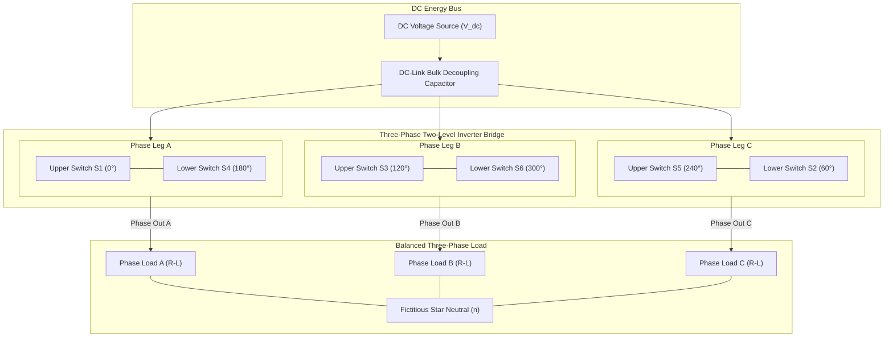

# Three-Phase DC-AC Voltage Source Inverter (VSI) Simulation & Harmonic Analysis

A rigorous power electronics modeling and harmonic analysis study of a two-level, three-phase Voltage Source Inverter (VSI) feeding balanced dynamic loads. Designed, modeled, and evaluated in MATLAB/Simulink, this project investigates semiconductor switching profiles, conduction topologies (180° vs 120° vs SPWM), line and phase voltage Fourier decompositions, triplen harmonic cancellations, and total harmonic distortion (THD) characteristics.

---

## Academic Provenance & Project Context

This research and simulation project was formally developed within the **Department of Mechatronics Engineering, Faculty of Engineering at Sana'a University**:

- **Academic Institution:** Sana'a University — Faculty of Engineering
- **Engineering Discipline:** Mechatronics Engineering & Industrial Automation
- **Course Focus:** Power Electronics & Motor Drive Systems
- **Academic Mentorship:** Supervised by **Dr. Radwan Al-Budhaji** & **Eng. Amjed Al-Shagthah**
- **Lead Engineering Contributor:** Hassan Moqbel Morshed Ghaleb

---

## Executive Overview & Power Conversion KPIs

Three-phase DC-AC inverters serve as the vital conversion backbone for variable-frequency drives (VFDs), grid-tied renewable energy systems (photovoltaic and wind generation), and uninterrupted power supplies (UPS). Achieving optimal power conversion requires balancing power factor, switching losses, semiconductor thermal boundaries, and harmonic content.

---

## System Architecture & Three-Phase Bridge Topology

The converter relies on a classical six-switch, three-phase bridge structure utilizing insulated-gate bipolar transistors (IGBTs) or power MOSFETs, each paralleled with an anti-parallel ultrafast freewheeling diode (FWD) to provide inductive energy recirculation paths.

---

## Theoretical & Mathematical Models

### 1. Six-Step (180° Conduction) Phase and Line Voltages
In a perfectly balanced 180° conduction star (Y) connected load, the relationship between the fundamental Line-to-Line ($V_{LL}$) and Line-to-Neutral ($V_{LN}$) voltages relies strictly on the DC-link voltage ($V_{dc}$):

$$ V_{LL} = \sqrt{3} \times V_{LN} $$

### 2. Three-Phase Instantaneous Balanced Power
Using the classical equations for a balanced three-phase system, we can derive the Real, Reactive, and Apparent Power metrics required for thermal and load engineering.

- **Active Power (Watts):** The true real power doing physical work.
  $$ P = \sqrt{3} \times V_{LL} \times I_L \times \cos(\phi) $$

- **Reactive Power (VARs):** The oscillatory magnetic field power.
  $$ Q = \sqrt{3} \times V_{LL} \times I_L \times \sin(\phi) $$

- **Apparent Power (VA):** The total geometric vector power supplied.
  $$ S = \sqrt{3} \times V_{LL} \times I_L $$

- **Power Factor (pf):** The efficiency ratio of the delivery pipeline.
  $$ p_f = \cos(\phi) = \frac{P}{S} $$

*(Where $I_L$ represents the Line Current and $\phi$ represents the phase angle differential between current and voltage).*

---

## Engineering Documents & Simulation Resources
The full academic and engineering analysis, complete with harmonic Fourier breakdowns, is documented in the central repository:
* 📄 **[Three Phase Inverter Engineering Report (PDF)](docs/Three_Phase_Inverter_Engineering_Report.pdf)**
* 📄 **[Three Phase Inverter Engineering Report (DOCX)](docs/Three_Phase_Inverter_Engineering_Report.docx)**

---

**Hassan Moqbel Morshed Ghaleb**  
Mechatronics Engineer | Mechanical Design & CAD (SolidWorks & AutoCAD) | Preventive Maintenance & Electromechanical Systems | Industrial Automation, Control Systems, Robotics & Intelligent Machines | CAD/FEA, Embedded Systems, Python & C++  
[GitHub](https://github.com/Hassan-Moqbel) · [Facebook](https://www.facebook.com/share/1BqxAgVjHi/) · [LinkedIn](https://www.linkedin.com/in/hassan-moqbel)

## License
This project is licensed under the [MIT License](LICENSE).
