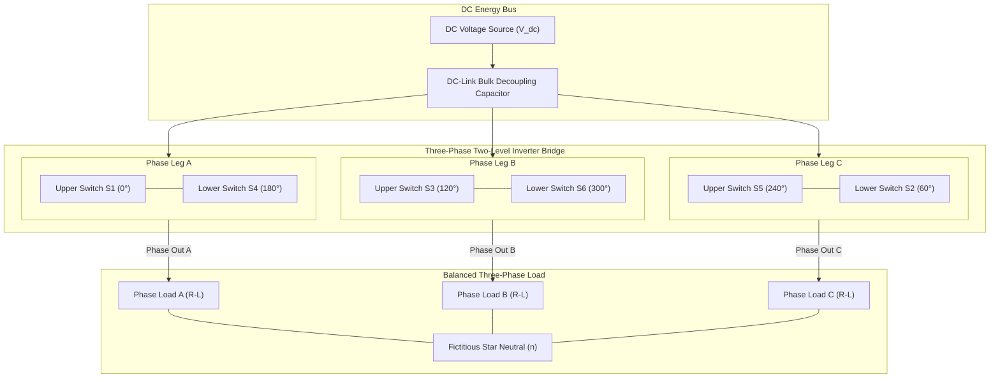

# Three-Phase DC-AC Voltage Source Inverter (VSI) Simulation & Harmonic Analysis

A rigorous power electronics modeling and harmonic analysis study of a two-level, three-phase Voltage Source Inverter (VSI) feeding balanced dynamic loads. Designed, modeled, and evaluated in MATLAB/Simulink, this project investigates semiconductor switching profiles, conduction topologies (180° vs 120° vs SPWM), line and phase voltage Fourier decompositions, triplen harmonic cancellations, and total harmonic distortion (THD) characteristics.

---

## Academic Provenance & Project Context

This research and simulation project was formally developed within the **Department of Mechatronics Engineering, Faculty of Engineering at Sana'a University**:

- **Academic Institution:** Sana'a University — Faculty of Engineering
- **Engineering Discipline:** Mechatronics Engineering & Industrial Automation
- **Course Focus:** Power Electronics & Motor Drive Systems
- **Academic Mentorship:** Supervised by **Dr. Radwan Al-Budhaji** & **Eng. Amjed Al-Shagthah**
- **Lead Engineering Contributor:** Hassan Moqbel Morshed Ghaleb

---

## Executive Overview & Power Conversion KPIs

Three-phase DC-AC inverters serve as the vital conversion backbone for variable-frequency drives (VFDs), grid-tied renewable energy systems (photovoltaic and wind generation), and uninterrupted power supplies (UPS). Achieving optimal power conversion requires balancing power factor, switching losses, semiconductor thermal boundaries, and harmonic content.

| Engineering Parameter | Theoretical Formulation | Simulated Operating Baseline |
| :--- | :--- | :--- |
| **DC Bus Voltage Input** | Constant Bus Supply ($V_{dc}$) | 400.0 V DC Link (Stiff Rail) |
| **Fundamental Output AC Freq** | $f_1 = \omega / (2\pi)$ | 50.0 Hz (314.16 rad/s Grid Standard) |
| **Line-to-Line RMS (180° Mode)** | $V_{LL,\text{rms}} = \sqrt{2/3} \cdot V_{dc}$ | 326.60 V RMS (Balanced 3-Phase) |
| **Phase-to-Neutral RMS (180°)** | $V_{LN,\text{rms}} = (\sqrt{2}/3) \cdot V_{dc}$ | 188.56 V RMS (Stepped Star Neutral) |
| **Carrier Switching Frequency** | $f_{sw} = m_f \cdot f_1$ | 2.50 kHz to 10.0 kHz (SPWM Studies) |
| **Theoretical THD (Line 180°)** | $\sqrt{(\pi^2 / 9) - 1}$ | 31.08% (Unfiltered Line-to-Line) |
| **Triplen Harmonic Attenuation** | Non-triplen odds ($6k \pm 1$) | Complete Line Cancellation ($n = 3, 9, \dots$) |

---

## System Architecture & Three-Phase Bridge Topology

The converter relies on a classical six-switch, three-phase bridge structure utilizing insulated-gate bipolar transistors (IGBTs) or power MOSFETs, each paralleled with an anti-parallel ultrafast freewheeling diode (FWD) to provide inductive energy recirculation paths.

---

## Theoretical & Mathematical Models

### 1. Six-Step (180° Conduction) Phase-to-Neutral Voltage

In 180° conduction mode, each switch conducts for 180° electrical. The phase-to-neutral terminal voltage ($v_{an}$) Fourier series expansion is:

$$
v_{an}(\omega t) = \frac{2 V_{dc}}{\pi} \sum_{n=1,3,5,\dots}^{\infty} \frac{1}{n} \left[ \frac{2}{3} - \frac{1}{3}\cos\left(\frac{n\pi}{3}\right) - \frac{1}{3}\cos\left(\frac{2n\pi}{3}\right) \right] \sin(n\omega t)
$$

For odd non-triplen harmonics ($n = 1, 5, 7, 11, \dots$), this simplifies to:

$$
v_{an}(\omega t) = \frac{2 V_{dc}}{\pi} \left[ \sin(\omega t) + \frac{1}{5}\sin(5\omega t) + \frac{1}{7}\sin(7\omega t) + \dots \right]
$$

The true RMS phase voltage evaluates to:

$$
V_{LN,\text{rms}} = \frac{\sqrt{2}}{3} V_{dc} \approx 0.4714 \cdot V_{dc}
$$

### 2. Line-to-Line Voltage & Triplen Harmonic Elimination

The line-to-line voltage is $v_{ab}(t) = v_{an}(t) - v_{bn}(t)$. Applying the 120° phase-shift transformation:

$$
v_{ab}(\omega t) = \frac{4 V_{dc}}{\pi} \sum_{n=1,3,5,\dots}^{\infty} \frac{1}{n} \cos\left(\frac{n\pi}{6}\right) \sin\left[ n\left(\omega t + \frac{\pi}{6}\right) \right]
$$

For all triplen multiples ($n = 3, 9, 15, \dots$), $\cos(n\pi / 6) = 0$. Consequently, triplen harmonics cancel completely across lines:

$$
V_{LL,\text{rms}} = \sqrt{\frac{2}{3}} V_{dc} \approx 0.8165 \cdot V_{dc}
$$

### 3. Sinusoidal Pulse-Width Modulation (SPWM) Dynamics

- **Amplitude Modulation Index ($m_a$):**

$$
m_a = \frac{\hat{V}_{\text{control}}}{\hat{V}_{\text{carrier}}} \implies V_{LL,1,\text{rms}} = \frac{\sqrt{3}}{2\sqrt{2}} m_a V_{dc} \approx 0.612 \cdot m_a V_{dc}
$$

- **Frequency Modulation Ratio ($m_f$):**

$$
m_f = \frac{f_{\text{carrier}}}{f_{\text{control}}} = \frac{f_{sw}}{f_1}
$$

### 4. Dead-Time Insertion Inequality (Shoot-Through Protection)

$$
t_{\text{dead}} \ge (t_{\text{off,max}} - t_{\text{on,min}}) + t_{\text{margin}}
$$

### 5. Balanced Three-Phase Instantaneous Power

$$
P_{3\phi} = \sqrt{3} V_{LL,\text{rms}} I_{L,\text{rms}} \cos(\phi)
$$

$$
Q_{3\phi} = \sqrt{3} V_{LL,\text{rms}} I_{L,\text{rms}} \sin(\phi)
$$

$$
p_f = \cos(\phi) = \frac{P_{3\phi}}{S_{3\phi}}
$$

## Switching State Truth Table (180° Conduction Mode)

| State | Interval | Upper ON | Lower ON | $v_{ab}$ | $v_{bc}$ | $v_{ca}$ | $v_{an}$ | $v_{bn}$ | $v_{cn}$ |
| :---: | :---: | :---: | :---: | :---: | :---: | :---: | :---: | :---: | :---: |
| **1** | 0° – 60° | $S_1, S_5$ | $S_6$ | $+V_{dc}$ | $-V_{dc}$ | 0 | $+V_{dc}/3$ | $-2V_{dc}/3$ | $+V_{dc}/3$ |
| **2** | 60° – 120° | $S_1$ | $S_6, S_2$ | $+V_{dc}$ | 0 | $-V_{dc}$ | $+2V_{dc}/3$ | $-V_{dc}/3$ | $-V_{dc}/3$ |
| **3** | 120° – 180° | $S_1, S_3$ | $S_2$ | 0 | $+V_{dc}$ | $-V_{dc}$ | $+V_{dc}/3$ | $+V_{dc}/3$ | $-2V_{dc}/3$ |
| **4** | 180° – 240° | $S_3$ | $S_4, S_2$ | $-V_{dc}$ | $+V_{dc}$ | 0 | $-V_{dc}/3$ | $+2V_{dc}/3$ | $-V_{dc}/3$ |
| **5** | 240° – 300° | $S_3, S_5$ | $S_4$ | $-V_{dc}$ | 0 | $+V_{dc}$ | $-2V_{dc}/3$ | $+V_{dc}/3$ | $+V_{dc}/3$ |
| **6** | 300° – 360° | $S_5$ | $S_4, S_6$ | 0 | $-V_{dc}$ | $+V_{dc}$ | $-V_{dc}/3$ | $-V_{dc}/3$ | $+2V_{dc}/3$ |

---

## Engineering Design Tradeoffs & Harmonic Performance

| Topology | Advantages | Drawbacks | Harmonic Profile | Application Domain |
| :--- | :--- | :--- | :--- | :--- |
| **Six-Step (180°)** | Lowest switching losses, max fundamental voltage ($V_{LL,1} = 0.78 V_{dc}$). | Bulky filtering needed for 5th, 7th, 11th harmonics. | High ($\approx 31.1\%$ Line THD). | High-power motor drives with inductive filtering. |
| **Six-Step (120°)** | Lower device conduction duty (120°), reduced thermal stress. | Lower voltage utilization, floating phase complicates neutral. | High harmonic content with dead intervals. | BLDC trapezoidal commutation systems. |
| **Sinusoidal PWM (SPWM)** | Harmonics pushed to carrier band ($m_f \pm 2$), easy passive LC filtering. | Higher switching losses, reduced fundamental ($V_{LL,1} \le 0.612 V_{dc}$). | Low baseband THD; ripples centered at $f_{sw}$. | Industrial VFDs, Solar Inverters, UPS systems. |
| **Space Vector PWM (SVPWM)** | 15.5% higher DC-bus utilization ($V_{LL,1} \le 0.707 V_{dc}$). | Requires trigonometric transforms ($\alpha\beta / dq$). | Minimal switching count, superior harmonic index. | EV traction inverters, precision servo drives. |

---

## Authentic Evidence & Project Artifacts

- **Full Engineering Report (PDF):** [`docs/Three_Phase_Inverter_Engineering_Report.pdf`](docs/Three_Phase_Inverter_Engineering_Report.pdf)
- **Technical Documentation (DOCX):** [`docs/Three_Phase_Inverter_Engineering_Report.docx`](docs/Three_Phase_Inverter_Engineering_Report.docx)
- **Simulation Schematics & Waveforms:** Preserved under [`docs/images/`](docs/images/) documenting stepped voltages, switching waveforms, and FFT spectra.

---

**Hassan Moqbel Morshed Ghaleb**  
Mechatronics Engineer | Mechanical Design & CAD (SolidWorks & AutoCAD) | Preventive Maintenance & Electromechanical Systems | Industrial Automation, Control Systems, Robotics & Intelligent Machines | CAD/FEA, Embedded Systems, Python & C++  
[GitHub](https://github.com/Hassan-Moqbel) · [Facebook](https://www.facebook.com/share/1BqxAgVjHi/) · [LinkedIn](https://www.linkedin.com/in/hassan-moqbel)

---

## License

This project is licensed under the [MIT License](LICENSE).